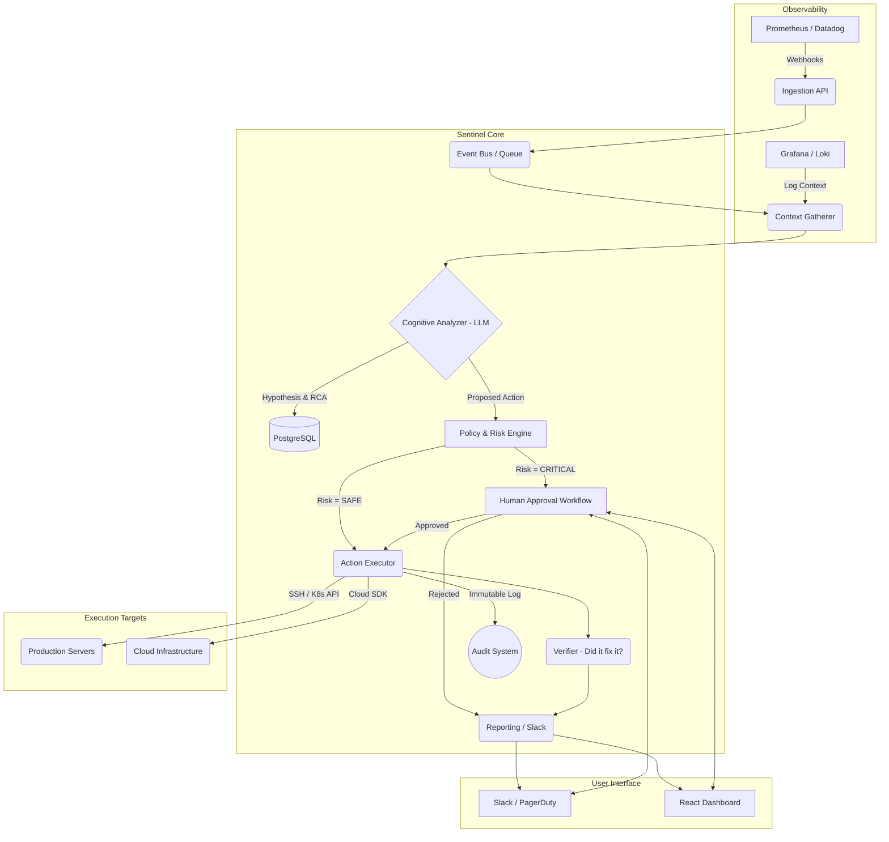
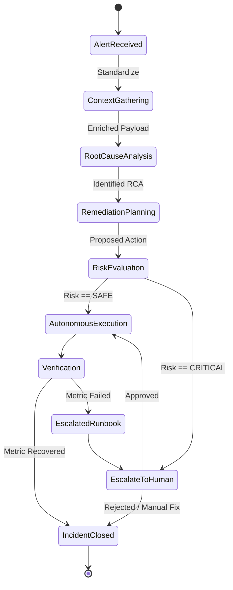

# SENTINEL - Autonomous AI DevOps & SRE Agent
## Architecture & System Design Document (v2.0)

**Date**: February 27, 2026  
**Context**: Migration from Phase 1 (MVP) to Phase 2 (Production-Grade Autonomous SRE Agent)

---

## 1. Industry Context (2025 State of SRE Agents)
To build a competitive and robust agent, SENTINEL's architecture is informed by current industry leaders and known failure modes:

*   **Azure SRE Agent**: Utilizes a "dual-action" approach (continuous monitoring + active response), heavily leveraging an integrated API ecosystem, Managed Identities, and Agentic workflows with human-approval gates for mitigation.
*   **Rootly AI**: Focuses heavily on *Knowledge Graph* construction (connecting code, telemetry, and docs) and reducing alert fatigue. Emphasizes "Human-in-the-Loop" for safety and iterative learning.
*   **PagerDuty Copilot**: Integrates directly into incident response workflows (Slack/Teams). Primary strengths are contextual Q&A ("What changed?") and automatic post-mortem generation.
*   **Known Failure Modes (HackerNews/Reddit)**:
    *   *Unintended Consequences & Hallucinations:* LLMs taking high-impact actions based on misread telemetry or prompt injection.
    *   *Lack of Accountability:* Non-replayable AI decisions making it impossible to audit *why* a decision was made.
    *   *Excessive Permissions:* Agents granted overly broad IAM roles leading to severe blast radius during compromise.

**SENTINEL's Differentiator**: True causal reasoning (not just probabilistic correlation) wrapped in strictly deterministic guardrails.

---

## 2. System Overview & Component Breakdown

SENTINEL follows a strict separation of concerns, ensuring that cognitive functions (LLMs) are isolated from execution functions by a deterministic Policy Engine.



### Component Responsibilities

1.  **Ingestion API (FastAPI)**: Receives raw alerts via webhooks. Standardizes payload structures into internal event schemas.
2.  **Context Gatherer (RAG / Data Ingestion)**: Queries adjacent systems (logs, recent git commits, metric baselines) to enrich the alert.
3.  **Cognitive Analyzer (LLM Engine)**: The core AI brain (using Causal Reasoning prompts). Analyzes the enriched context to determine root cause and propose remediation steps.
4.  **Policy & Risk Engine (Deterministic)**: Evaluates the LLM's proposed action against a hardcoded risk matrix and RBAC rules. Never uses an LLM.
5.  **Action Executor**: Interfaces with production (SSH, K8s API, Cloud APIs). Uses ephemeral, minimum-privilege credentials.
6.  **Audit System**: An append-only persistence layer. Records the exact context, LLM prompt, LLM output, Risk Policy evaluation, and Execution result.

---

## 3. Agent Graph Specification (Routing & State)

SENTINEL's internal agentic workflow is modeled as a state machine / graph (implementable via LangGraph or a custom orchestrator).



**Tool Inventory for the Agent:**
*   `query_metrics(PromQL)`
*   `fetch_recent_logs(service, timeframe)`
*   `list_recent_deployments(environment)`
*   `restart_kubernetes_pod(namespace, pod)`
*   `flush_redis_cache(cluster)`
*   `rollback_deployment(service, version)` (Requires Human Approval)

---

## 4. Data Models (Core Entities)

The persistence layer (PostgreSQL) should utilize the following core schemas.

**1. Incident Model**
```json
{
  "incident_id": "uuid",
  "status": "OPEN | ANALYZING | MITIGATING | CLOSED",
  "source_alert": { "type": "CPU_HIGH", "service": "payment-api" },
  "enriched_context": "jsonb", // Logs, traces gathered
  "rca_hypothesis": "text", // LLM output
  "created_at": "timestamp"
}
```

**2. Remediation Plan Model**
```json
{
  "plan_id": "uuid",
  "incident_id": "uuid",
  "proposed_action": "RESTART_POD",
  "target_resource": "payment-api-deployment",
  "risk_level": "SAFE | WARNING | CRITICAL",
  "human_approved": "boolean | null",
  "execution_status": "PENDING | SUCCESS | FAILED"
}
```

**3. Audit Log Model (WORM / Append-Only Table)**
```json
{
  "audit_id": "uuid",
  "timestamp": "timestamp",
  "actor": "SENTINEL_AGENT | HUMAN_USER",
  "action_type": "LLM_INFERENCE | POLICY_EVAL | SCRIPT_EXEC",
  "details": "jsonb", // Exact prompts, exact API responses, exact CLI outputs
  "cryptographic_hash": "string" // For SOC2 non-repudiation
}
```

---

## 5. Identifying & Mitigating the Top 3 Highest-Risk Decisions

### Risk 1: LLM Hallucinations Triggering Destructive Actions
**The Threat:** The LLM misinterprets a spike in CPU as a rogue process and proposes deleting a critical database pod, hallucinating that it's a safe action.
**Mitigation ("Deterministic Guardrails"):**
1.  **Strict Decoupling:** The LLM *only* outputs a standardized JSON payload requesting an action ID and parameters. It cannot execute scripts directly.
2.  **Hardcoded Risk Matrix:** The `Policy & Risk Engine` maps every Action ID to a static risk level. The LLM cannot override that `DELETE_DB_POD` is `CRITICAL` and thus strictly requires human approval.
3.  **Allowed Values Lists:** Actions only accept parameters predefined in current infrastructure state (fetched deterministically, not generated by AI).

### Risk 2: Over-Privileged Agent IAM (Blast Radius)
**The Threat:** The `Action Executor` is given generic "Admin" access to AWS/K8s so it "can fix anything". A prompt injection or exploit allows an attacker to wipe the infrastructure.
**Mitigation ("Minimum Privilege & JIT Access"):**
1.  **Granular Roles:** The agent runs under a highly restricted IAM Service Account. It only has permissions to restart pods or flush caches, not to delete clusters or alter IAM policies.
2.  **Just-In-Time (JIT) Elevation:** For higher-risk actions approved by a human, the human's approval token passes an ephemeral, time-bound assumed role to the agent specifically scoped *only* for that action.

### Risk 3: Lack of Explainability & Non-Replayable Decisions
**The Threat:** The agent takes an action that partially degrades a service. During the post-mortem, engineers cannot figure out *why* the AI made that decision because LLMs are stochastic black boxes.
**Mitigation ("Causal Tracing & WORM Auditing"):**
1.  **Chain-of-Thought Logging:** The LLM must be prompted to output a `reasoning` trace alongside its `action`.
2.  **Snapshotting:** The `Context Gatherer` saves an exact snapshot of the telemetry data *at the time* the decision was made.
3.  **Immutable Audit Log:** Everything is persisted in the `Audit` table, providing a 100% replayable trace of inputs and outputs for SOC2 compliance and human review.

---

## 6. Recommended Implementation Order (Next Phases)

1.  **Database Migration (Persistence):** Move from `audit.log` MVP to PostgreSQL using SQLAlchemy or SQLModel.
2.  **Agentic Engine Implementation:** Integrate LangChain/LlamaIndex. Implement the Agent Graph (Context Gatherer -> RCA -> Planner).
3.  **Real Ingestion & Tooling:** Build the FastAPI endpoints to accept real Prometheus Alertmanager payloads. Start writing real Python executor scripts for initial "Safe" actions.
4.  **UI & Human-in-the-Loop:** Build the React Dashboard and Slack integrations to test the Approval Workflow for "Critical" actions.
